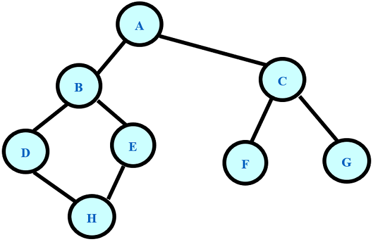

# Graph(图)

Some algorithmic code about Graph.

## Learn More About the Storage Structure of the Graph

### 1. Adjacency Matrix

```c++
#define INFINITY INT_MAX
#define MAX_VERTEX_NUM 20
#define MAX_NAME 5
typedef enum {DG,UDG,DN,UDN} GraphKind;

typedef struct ArcCell {
    int adj;
    char* info;
}ArcCell, AdjMatrix[MAX_VERTEX_NUM][MAX_VERTEX_NUM];

typedef struct MGraph {
    char vexs[MAX_VERTEX_NUM][MAX_NAME];
    AdiMatrix arcs;
    int vexnum, arcnum;
    GraphKind kind;
}MGraph;
```


### 2. Adjacency List

```c++
#define MAX_VERTEX_NUM 20
#define MAX_NAME 5
typedef struct ArcNode {
   int adj;
   struct ArcNode* nextarc;
   char* info;
}ArcNode;

typedef struct VNode {
   char data[MAX_NAME];
   ArcNode* firstarc;
}VNode, AdjList[MAX_VERTEX_NUM];

typedef struct ALGragh {
    AdjList vertices;
    int vexnum, arcnum;
    int kind;
}ALGraph;

```

### 3. 邻接矩阵的测试

```c++
// 复制到输入
2
8 8
A B C D E F G H
A B
A C
B D
B E
C F
C G
D H
E H
```

